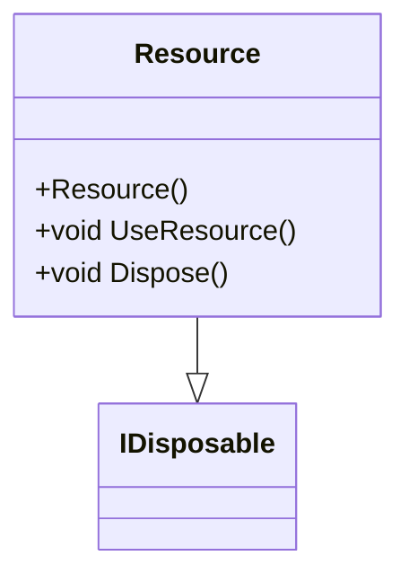
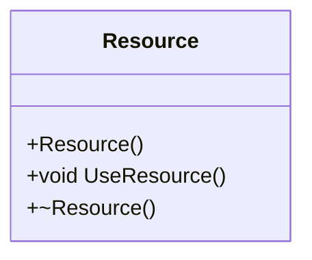
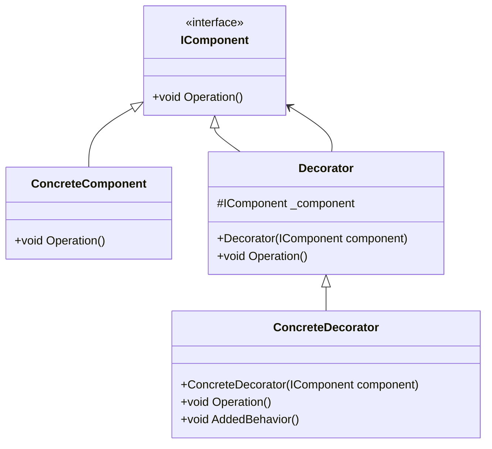
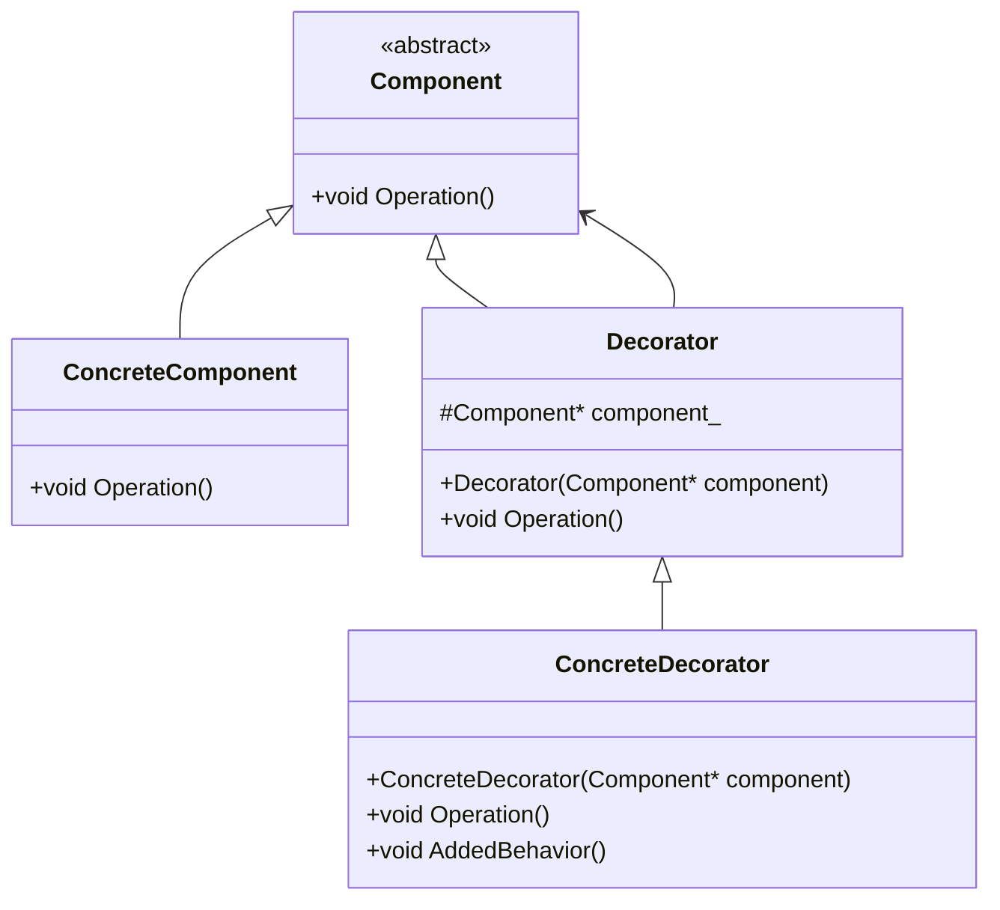
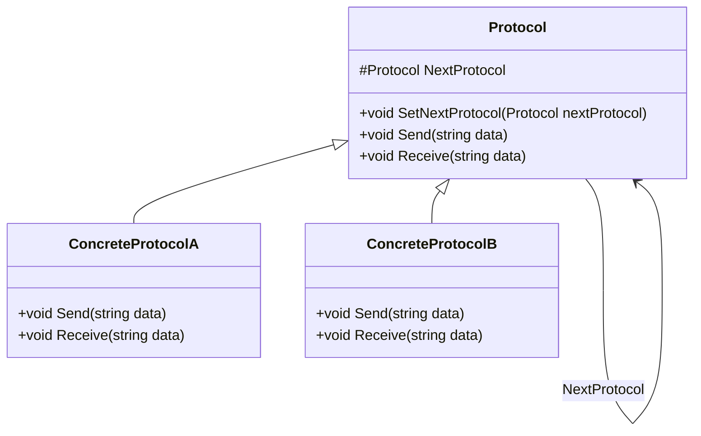
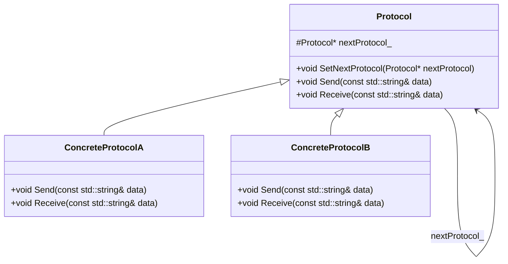
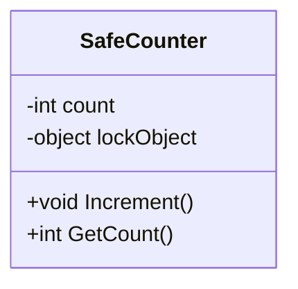
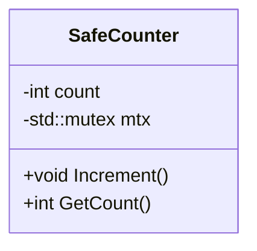

# APPZ_RR

# UML-діаграми для шаблонів проектування

Цей файл містить UML-діаграми для чотирьох шаблонів проектування: Resource Acquisition Is Initialization (RAII), Decorator, Protocol Stack та Lock.

## Creational Pattern: Resource Acquisition Is Initialization (RAII)

### Діаграма класів (C#)

### Діаграма класів (C++)

## Structural Pattern: Decorator

### Діаграма класів (C#)

### Діаграма класів (C++)

## Behavioral Pattern: Protocol Stack

### Діаграма класів (C#)

### Діаграма класів (C++)

## Concurrency Pattern: Lock

### Діаграма класів (C#)

### Діаграма класів (C++)

